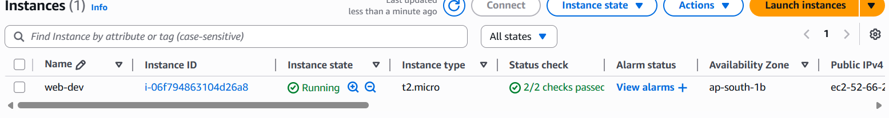
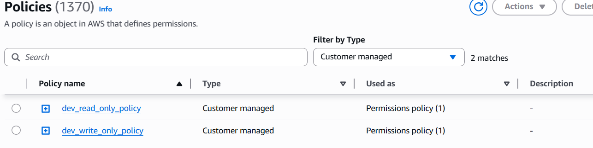
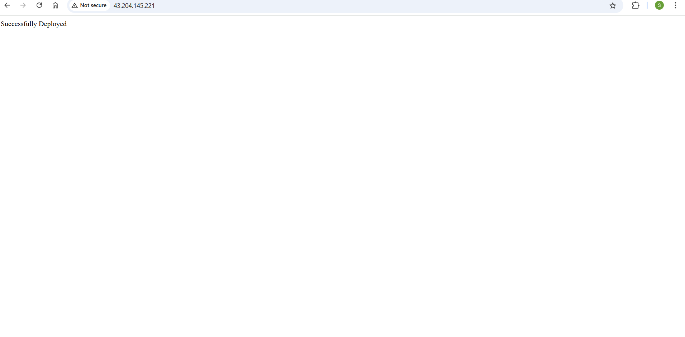
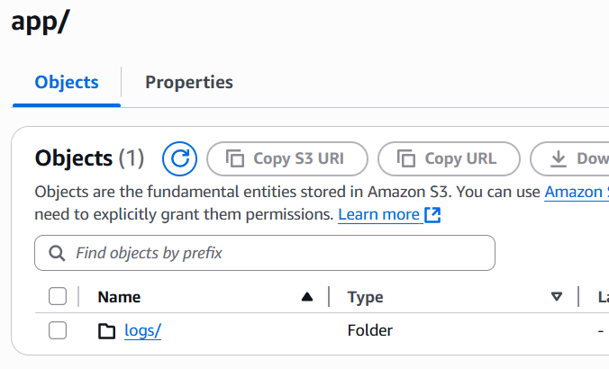

 # TechEazyassisment
## ⚙️ Terraform Workflow

This section outlines how to provision infrastructure on AWS using Terraform with support for **multiple environments** via **workspaces** and **`.tfvars` files**.

### 📌 Prerequisites

* Terraform installed (`terraform -v`)
* AWS CLI configured (`aws configure`)
* AWS access keys 
* Valid EC2 AMI ID and key pair (e.g. from Mumbai region)

### 📁 Terraform Files

```
terraform/
├── main.tf
├── variable.tf
├── dev.tfvars
├── prod.tfvars
├── output.tf
├── scripts/
│   └── setup.sh
```

### 🛠️ Step-by-Step Terraform Flow

#### ✅ 1. Initialize Terraform

```bash
cd terraform/
terraform init
```

#### ✅ 2. Create & Select Workspace (Dev or Prod)

```bash
# Create workspace
terraform workspace new dev

# OR switch to existing
terraform workspace select dev
```

To list workspaces:

```bash
terraform workspace list
```

#### ✅ 3. Plan Infrastructure

```bash
terraform plan -var-file="dev.tfvars"
```

For production:

```bash
terraform workspace select prod
terraform plan -var-file="prod.tfvars"
```

#### ✅ 4. Apply Infrastructure

```bash
terraform apply -auto-approve -var-file="dev.tfvars"
```

#### ✅ 5.  Destroy Infrastructure

```bash
terraform destroy -auto-approve -var-file="dev.tfvars"
```
✅ 1. EC2 Dashboard


2. S3 Bucket Dashboard


3. IAM Policies

---
🚀 Java App Automation Setup

🧱 Step-by-Step Setup
1 .Check Java and Maven:
```bash
java -version
source /etc/profile.d/maven.sh
mvn -v
```
2.Clone the Repository:
```bash
git clone https://github.com/techeazy-consulting/techeazy-devops.git
cd techeazy-devops
```
3.Build the Project:
```bash
mvn install
```
4.Create and Fix Log File Permissions:
```bash
sudo touch /opt/app.log
sudo chown ec2-user:ec2-user /opt/app.log
```
⚙️ Automate App Startup
Create the automation script:
```bash
vi automate.sh
```
Paste the following contents:
```bash
#!/bin/bash

# Start the Java app in background and log output to /opt/app.log
sudo nohup java -jar /home/ec2-user/techeazy-devops/target/techeazy-devops-0.0.1-SNAPSHOT.jar > /opt/app.log 2>&1 &

# Log startup time
sudo bash -c 'echo "App manually started at \$(date)" >> /opt/app.log'
```
Make it executable:
```bash
chmod +x automate.sh
```
Run the script:
```bash
./automate.sh
```
📄 Log Output
Check the application logs:
```bash
cat /opt/app.log
```
> The app will run at: `http://43.204.145.221:80/`


📦 Log Upload Automation on EC2 Shutdown To S3 Bucket

To ensure logs are not lost when the EC2 instance stops or terminates, a shutdown automation is implemented.

🔄 What It Does
On instance shutdown, a custom script automatically uploads:

/var/log/cloud-init.log → S3

/opt/app.log → S3

This ensures that all important logs are preserved for auditing and debugging purposes.

⚙️ How It Works

A shutdown script (/opt/shutdown.sh) is created via the EC2 user data.

A systemd service (upload-logs.service) is registered to run the script on shutdown.

The script uses the AWS CLI and EC2 IAM Role with s3:PutObject permission

✅ Result

Logs are automatically backed up to your S3 bucket every time the EC2 instance is stopped or terminated — with no manual effort required.





  


