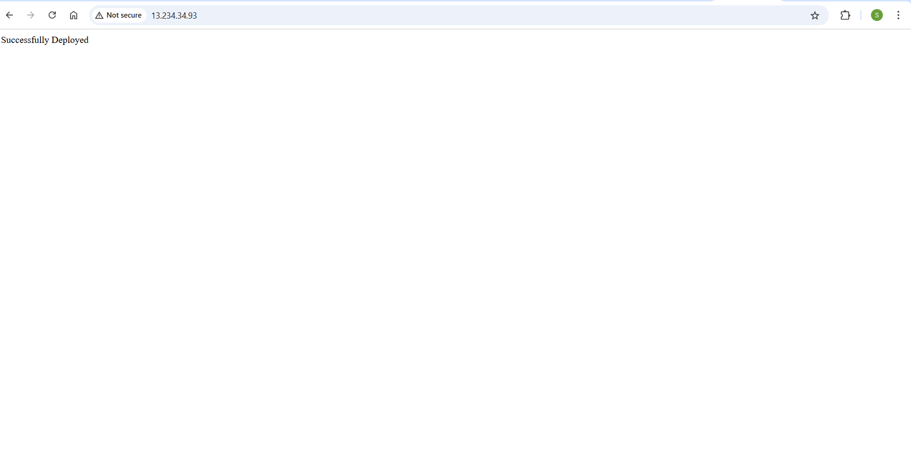

⚙️ Terraform Workflow

This section outlines how to provision infrastructure on AWS using Terraform with support for multiple environments via workspaces and .tfvars files.

📌 Prerequisites

Terraform installed (terraform -v)

AWS CLI configured (aws configure)

AWS access keys with EC2 permission

Valid EC2 AMI ID and key pair (e.g. from Mumbai region)

📁 Terraform Files
```bash
terraform/
├── main.tf
├── variable.tf
├── dev.tfvars
├── prod.tfvars
├── output.tfvars
├── script.sh
```
🛠️ Step-by-Step Terraform Flow

✅ 1. Initialize Terraform

```bash
cd terraform/
terraform init
```
✅ 2. Create & Select Workspace (Dev or Prod)
```bash
# Create workspace
terraform workspace new dev

# OR switch to existing
terraform workspace select dev
```
To list workspaces:
```bash
terraform workspace list
```
✅ 3. Plan Infrastructure
```bash
terraform plan -var-file="dev.tfvars"
```
For production:
```
terraform workspace select prod
terraform plan -var-file="prod.tfvars"
```
✅ 4. Apply Infrastructure
```bash
terraform apply -auto-approve -var-file="dev.tfvars"
```
✅ 5. (Optional) Destroy Infrastructure
```
terraform destroy -auto-approve -var-file="dev.tfvars"

🛠️ Build & Deploy Spring Boot App
```bash
# Install Java & Maven if not done
sudo apt update && sudo apt install -y openjdk-21-jdk maven

# Clone your repo
git clone https://github.com/<your-username>/<repo-name>.git
cd repo-name/spring-boot-app

# Build the application
mvn clean install

# Run the JAR
sudo java -jar target/techeazy-devops-0.0.1-SNAPSHOT.jar
```
The app will run at: http://13.234.34.93:80/


